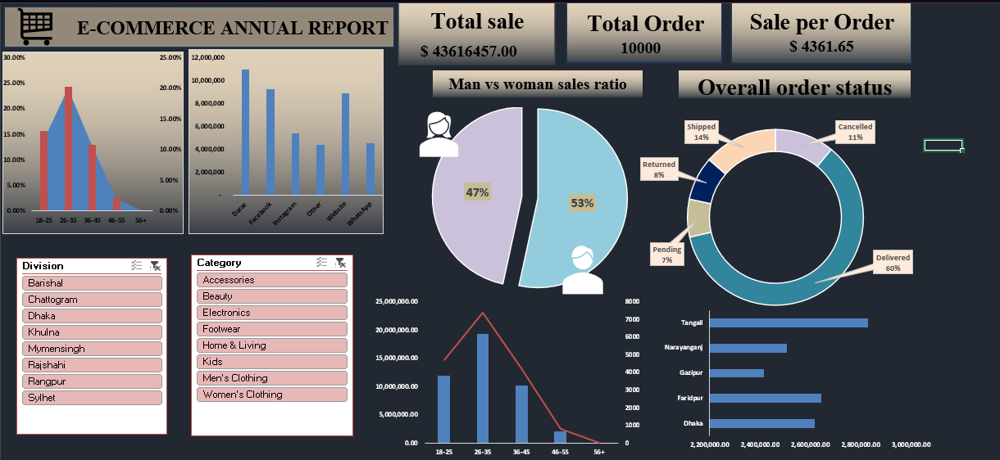
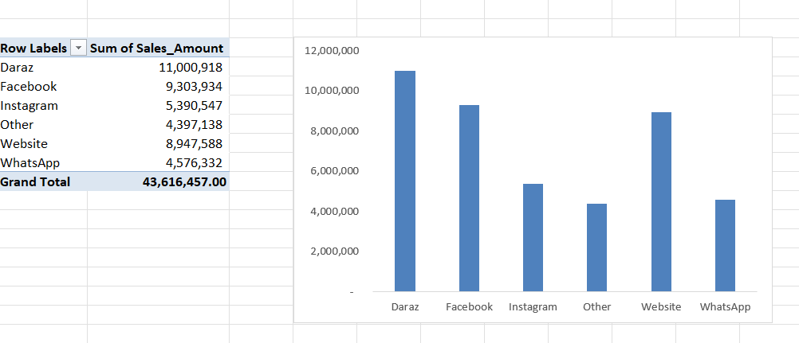
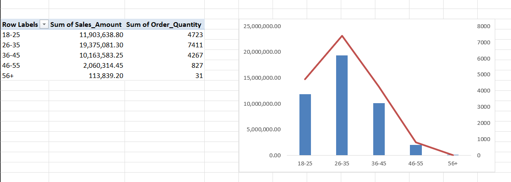
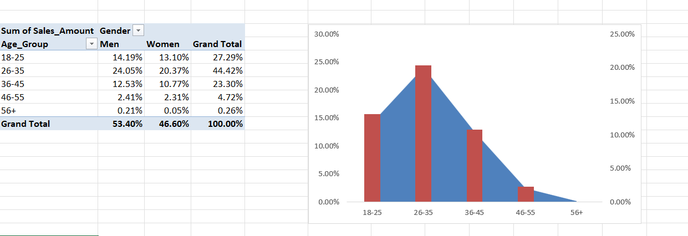
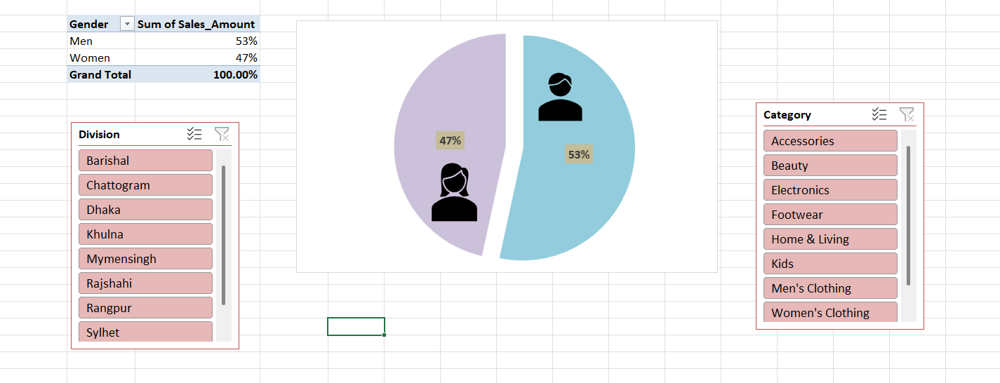
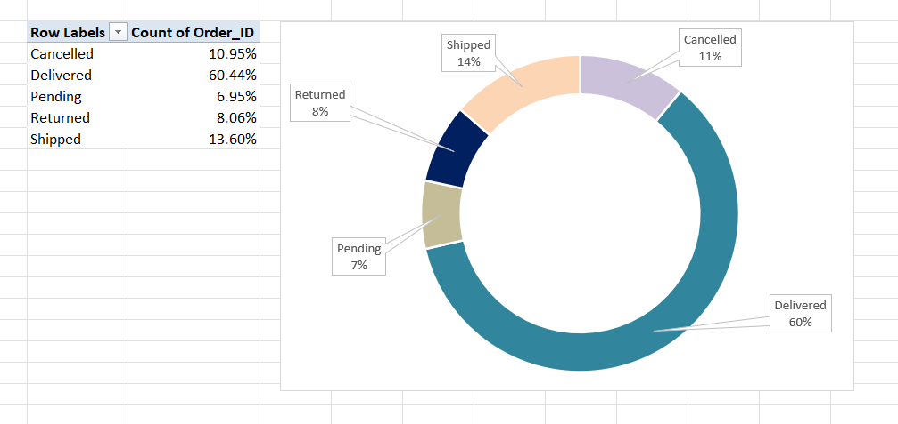
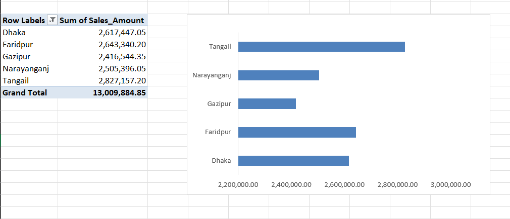
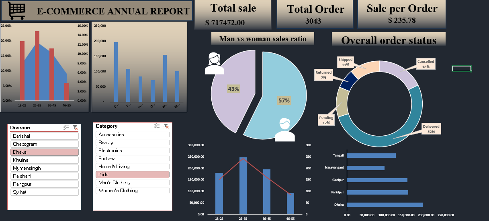
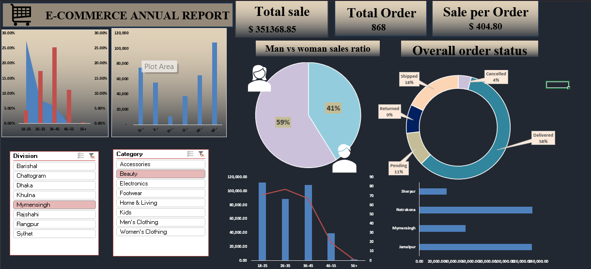

# E-commerce Annual Sales Dashboard

An interactive Excel dashboard that analyzes one year of e-commerce sales. It shows how much was sold, who is buying, where sales come from, and what happens to orders after they are placed. Slicers let you filter the whole dashboard by **Division** and **Category** with one click.

## Project Overview

The goal of this project is to turn raw sales data (10,000 orders) into a clear, easy-to-read report. The dashboard answers questions like:
- How much did we sell in total, and how much is each order worth?
- Which sales channel brings in the most money?
- Which age group and gender spend the most?
- How many orders are delivered, cancelled, returned, or still pending?
- Which locations sell the most?

## Dashboard Preview

Full dashboard with no filters applied:

## Key Numbers (Full Year)

| Metric | Value |
|---|---|
| Total sales | $43,616,457 |
| Total orders | 10,000 |
| Average sale per order | $4,361.65 |

## Dashboard Screenshots

### 1. Sales by Channel
Shows how much money each sales channel earned.

- Daraz is the top channel with about $11.0M (25% of sales).
- Facebook is second with about $9.3M, and the Website is third with about $8.9M.
- These three channels together bring in about 67% of all sales.
- Instagram, WhatsApp, and Other channels each bring in $4.4M to $5.4M.

### 2. Sales and Orders by Age Group
Bars show sales amount. The red line shows the number of units ordered.

| Age group | Sales | Units ordered |
|---|---|---|
| 18-25 | $11.9M | 4,723 |
| 26-35 | $19.4M | 7,411 |
| 36-45 | $10.2M | 4,267 |
| 46-55 | $2.1M | 827 |
| 56+ | $0.1M | 31 |

The 26-35 age group is the biggest buyer on both sales and units.

### 3. Sales Share by Age Group and Gender
Shows what percentage of total sales comes from each age group, split by men and women.

- 26-35 makes up 44.42% of all sales, the largest share.
- Ages 18-35 together make up about 72% of sales.
- Men are ahead of women in every age group.
- Buyers aged 56+ account for only 0.26% of sales.

### 4. Men vs Women Sales Ratio
Compares total sales from men and women. The Division and Category slicers are visible beside the chart.

Men account for 53% of sales and women for 47%.

### 5. Overall Order Status
Shows what percentage of orders ended up in each status.

| Status | Share of orders |
|---|---|
| Delivered | 60.44% |
| Shipped | 13.60% |
| Cancelled | 10.95% |
| Returned | 8.06% |
| Pending | 6.95% |

About 19% of orders are cancelled or returned, which is a possible area to improve.

### 6. Top 5 Locations by Sales
Shows the five top-selling locations (filtered to the top 5).

Tangail leads with about $2.83M, followed by Faridpur ($2.64M), Dhaka ($2.62M), Narayanganj ($2.51M), and Gazipur ($2.42M).

## Slicer Filtering Examples

The dashboard has two slicers, **Division** and **Category**. When you click one, every chart and number updates to match. Here are two examples.

### Example 1: Division = Dhaka, Category = Kids

- Total sales: $717,472
- Total orders: 3,043
- Sale per order: $235.78
- Men 57%, Women 43%
- Delivered 52%, Cancelled 18%

### Example 2: Division = Mymensingh, Category = Beauty

- Total sales: $351,368.85
- Total orders: 868
- Sale per order: $404.80
- Women 59%, Men 41%
- Delivered 58%, Cancelled only 4%

Comparing the two shows how results change by location and product type. Beauty buyers in Mymensingh are mostly women and spend more per order, while Kids products in Dhaka are bought more by men and have more cancellations.

## Key Insights

1. Sales are concentrated in a few channels. Daraz, Facebook, and the Website bring in about 67% of revenue.
2. Young adults drive sales. The 26-35 group is the biggest spender, and ages 18-35 make up about 72% of sales.
3. Men spend slightly more than women overall (53% vs 47%), but this reverses in some filters, such as Beauty in Mymensingh.
4. Most orders succeed. 60% are delivered, but around 19% are cancelled or returned.
5. Performance varies by location and category, so filtering with the slicers gives more useful answers than looking at totals alone.

## Possible Recommendations

- Invest more in Daraz, Facebook, and the Website, and look at why Instagram and WhatsApp earn less.
- Target the 18-35 age group in campaigns.
- Look into the causes of cancellations and returns to reduce lost sales.
- Compare categories by location and gender to plan products and promotions.

## Features

- Interactive slicers (Division and Category) that filter the whole dashboard
- KPI cards for Total Sale, Total Order, and Sale per Order
- PivotTables and charts that update automatically
- Combo charts (bars plus a line) comparing sales and order quantity
- Donut and pie charts for order status and gender split

## Tools Used

Microsoft Excel: PivotTables, Pivot Charts, Slicers, Combo Charts, KPI Cards

## How to Use This Dashboard

1. Click `Ecommerce-Annual-Sales-Dashboard.xlsx` in the file list above.
2. Click the **Download** icon at the top right of the file page.
3. Open the file in **Microsoft Excel** on your computer. Don't use Google Sheets, because it changes the design and slicers may not work.
4. Click the Division or Category slicers and watch the charts update.
5. Click the small filter-clear icon on a slicer to reset the dashboard.
